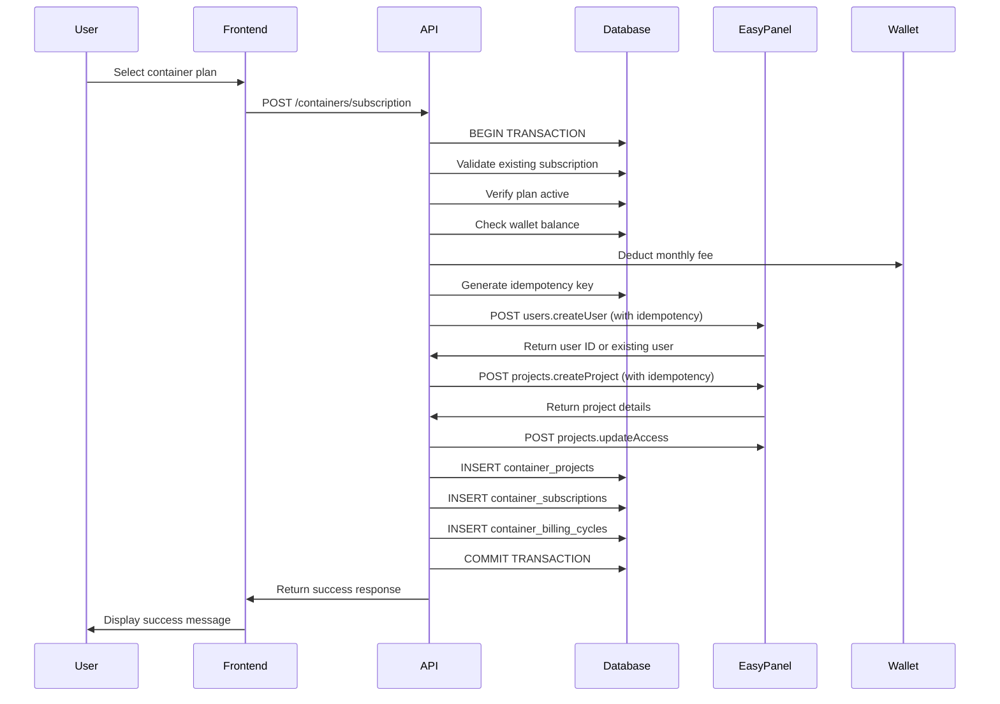

# EasyPanel Subscription Workflow Technical Specification

## 1. Overview

This document specifies the implementation of a robust subscription workflow that orchestrates EasyPanel user and project creation when a client purchases a plan from the `/containers/plan` page. The workflow ensures transactional integrity, proper error handling, and immediate UI updates while maintaining idempotency and comprehensive logging.

## 2. EasyPanel API Integration

### 2.1 Available API Endpoints

Based on the OpenAPI documentation (`repo-docs/provider-api-files/easypanel/openapi.json`), the following endpoints are available:

#### User Management
- **Create User**: `POST /api/trpc/users.createUser`
  - Request: `{ email: string, password: string, admin: boolean }`
  - Response: `{ id: string, email: string }`

- **List Users**: `GET /api/trpc/users.listUsers`
  - Response: `Array<{ id: string, email: string, admin: boolean }>`

#### Project Management
- **Create Project**: `POST /api/trpc/projects.createProject`
  - Request: `{ name: string }`
  - Response: `{ name: string, createdAt: string, updatedAt: string }`

- **Delete Project**: `POST /api/trpc/projects.destroyProject`
  - Request: `{ name: string }`
  - Response: `void`

- **Update Project Access**: `POST /api/trpc/projects.updateAccess`
  - Request: `{ projectName: string, userId: string, active: boolean }`
  - Response: `void`

### 2.2 Authentication
- Bearer token authentication via `Authorization: Bearer {api_key}` header
- API key stored encrypted in database or environment variable

## 3. Current Implementation Analysis

### 3.1 Existing Workflow (containerPlanService.ts)
The current subscription process in `subscribe()` method:

1. **Validation**: Check for existing active subscription
2. **Plan Verification**: Verify plan exists and is active
3. **Wallet Check**: Validate sufficient wallet balance
4. **Payment Processing**: Deduct monthly fee from wallet
5. **User Creation**: Create EasyPanel user with generated password
6. **Subscription Record**: Create container_subscriptions entry
7. **Project Creation**: Create initial EasyPanel project
8. **Access Control**: Grant user access to project
9. **Database Persistence**: Store project in container_projects table
10. **Billing Cycle**: Create initial billing cycle record

### 3.2 Current Cancellation Workflow
The `cancelSubscription()` method:

1. **Validation**: Verify subscription exists and is active
2. **Refund Calculation**: Calculate prorated refund amount
3. **Project Cleanup**: Delete all Easypanel projects via API
4. **Database Cleanup**: Remove projects from container_projects table
5. **Wallet Credit**: Add refund to organization wallet
6. **Status Update**: Mark subscription as cancelled

## 4. Required Enhancements

### 4.1 Transactional Integrity
The entire workflow must be wrapped in a database transaction with proper rollback mechanisms:

```sql
BEGIN;
-- Validate existing subscription
-- Verify plan and wallet
-- Create EasyPanel user
-- Create EasyPanel project
-- Persist to database
-- Create billing cycle
COMMIT;
```

**Rollback Strategy**:
- If EasyPanel API calls fail, rollback database changes
- If database persistence fails, attempt to cleanup EasyPanel resources
- Maintain audit trail of all operations for recovery

### 4.2 Idempotency Implementation

#### Idempotency Key Generation
```typescript
// Generate unique idempotency key for each operation
const generateIdempotencyKey = (operation: string, organizationId: string, timestamp: string): string => {
  return `${operation}-${organizationId}-${timestamp}-${crypto.randomBytes(8).toString('hex')}`;
};
```

#### API Call Implementation
All EasyPanel API calls must include idempotency keys:
- Store idempotency keys in `easypanel_idempotency_keys` table
- Check for existing responses before making API calls
- Return cached responses for duplicate requests

### 4.3 Enhanced Error Handling

#### Error Categories
1. **Validation Errors**: Invalid input, insufficient funds
2. **API Errors**: EasyPanel API failures, network issues
3. **Database Errors**: Constraint violations, connection issues
4. **Business Logic Errors**: Duplicate users, existing subscriptions

#### Error Recovery
- **User Creation Failure**: Check if user already exists, proceed with existing user
- **Project Creation Failure**: Attempt cleanup and retry with different name
- **Database Failure**: Rollback EasyPanel changes if possible
- **Network Failures**: Implement exponential backoff with jitter

### 4.4 Structured JSON Logging

#### Log Format
```json
{
  "timestamp": "2024-01-15T10:30:00.000Z",
  "level": "info",
  "operation": "easypanel.user.create",
  "organization_id": "org-123",
  "request_id": "req-456",
  "idempotency_key": "user-create-org-123-20240115103000-abc123",
  "request": {
    "email": "user@example.com",
    "admin": false
  },
  "response": {
    "id": "user-789",
    "email": "user@example.com"
  },
  "elapsed_ms": 245,
  "status_code": 200,
  "success": true
}
```

#### Required Log Fields
- `timestamp`: ISO 8601 format with milliseconds
- `level`: debug, info, warn, error
- `operation`: Specific operation being performed
- `organization_id`: Organization identifier
- `request_id`: Unique request identifier
- `idempotency_key`: Idempotency key for the operation
- `elapsed_ms`: Request duration in milliseconds
- `status_code`: HTTP status code
- `success`: Boolean success indicator

### 4.5 Database Schema Extensions

#### New Table: easypanel_idempotency_keys
```sql
CREATE TABLE easypanel_idempotency_keys (
    id UUID PRIMARY KEY DEFAULT uuid_generate_v4(),
    operation VARCHAR(100) NOT NULL,
    idempotency_key VARCHAR(255) NOT NULL UNIQUE,
    organization_id UUID NOT NULL REFERENCES organizations(id) ON DELETE CASCADE,
    request_hash VARCHAR(64) NOT NULL,
    response_data JSONB,
    response_status INTEGER,
    created_at TIMESTAMP WITH TIME ZONE DEFAULT NOW(),
    expires_at TIMESTAMP WITH TIME ZONE DEFAULT (NOW() + INTERVAL '24 hours')
);

CREATE INDEX idx_easypanel_idempotency_lookup ON easypanel_idempotency_keys(operation, idempotency_key);
CREATE INDEX idx_easypanel_idempotency_expires ON easypanel_idempotency_keys(expires_at);
```

#### Enhanced container_projects Table
```sql
ALTER TABLE container_projects 
ADD COLUMN IF NOT EXISTS easypanel_user_id VARCHAR(255),
ADD COLUMN IF NOT EXISTS created_via_api BOOLEAN DEFAULT false,
ADD COLUMN IF NOT EXISTS api_creation_error TEXT,
ADD COLUMN IF NOT EXISTS last_api_sync TIMESTAMP WITH TIME ZONE;
```

## 5. Enhanced Workflow Implementation

### 5.1 Subscription Workflow Sequence



### 5.2 User Creation Logic Enhancement

```typescript
private async createOrGetEasypanelUser(
  email: string, 
  password: string, 
  idempotencyKey: string
): Promise<{ id: string; email: string; isNew: boolean }> {
  try {
    // Attempt to create user
    const user = await easypanelService.createUser(email, password, false);
    return { ...user, isNew: true };
  } catch (error: any) {
    // Check if user already exists
    if (error.message.includes('already exists')) {
      const users = await easypanelService.listUsers();
      const existingUser = users.find(u => u.email === email);
      if (existingUser) {
        return { ...existingUser, isNew: false };
      }
    }
    throw error;
  }
}
```

### 5.3 Project Creation with Retry Logic

```typescript
private async createEasypanelProjectWithRetry(
  projectName: string, 
  maxRetries: number = 3
): Promise<EasypanelProject> {
  let lastError: Error;
  
  for (let attempt = 1; attempt <= maxRetries; attempt++) {
    try {
      const projectNameAttempt = attempt === 1 ? projectName : `${projectName}-${attempt}`;
      return await easypanelService.createProject(projectNameAttempt);
    } catch (error: any) {
      lastError = error;
      
      if (error.message.includes('already exists')) {
        // Try with different name
        continue;
      }
      
      if (attempt < maxRetries) {
        // Exponential backoff
        await new Promise(resolve => setTimeout(resolve, Math.pow(2, attempt) * 1000));
      }
    }
  }
  
  throw lastError!;
}
```

## 6. Cancellation Handler Enhancement

### 6.1 Cascading Delete Implementation

```typescript
private async performCascadingDelete(
  organizationId: string,
  subscriptionId: string
): Promise<{ projectsDeleted: number; servicesDeleted: number }> {
  const projects = await this.getOrganizationProjects(organizationId);
  let projectsDeleted = 0;
  let servicesDeleted = 0;

  for (const project of projects) {
    try {
      // Get all services in project
      const services = await this.getProjectServices(project.id);
      
      // Delete services first (if API available)
      for (const service of services) {
        try {
          await this.deleteEasypanelService(project.easypanel_project_name, service.service_name);
          servicesDeleted++;
        } catch (error) {
          console.error(`Failed to delete service ${service.service_name}:`, error);
        }
      }
      
      // Delete project
      await easypanelService.destroyProject(project.easypanel_project_name);
      projectsDeleted++;
      
      // Remove from database
      await this.deleteProjectFromDatabase(project.id);
      
    } catch (error) {
      console.error(`Failed to delete project ${project.easypanel_project_name}:`, error);
      // Continue with other projects
    }
  }

  return { projectsDeleted, servicesDeleted };
}
```

## 7. Testing Strategy

### 7.1 Test Scenarios

#### A. Successful First-Time Purchase Flow
```typescript
describe('Container Subscription Workflow', () => {
  it('should successfully create subscription for new user', async () => {
    // Mock EasyPanel API responses
    mockEasypanelCreateUser.mockResolvedValue({ id: 'user-123', email: 'test@example.com' });
    mockEasypanelCreateProject.mockResolvedValue({ name: 'test-project', createdAt: new Date().toISOString() });
    mockEasypanelUpdateAccess.mockResolvedValue(undefined);
    
    // Execute subscription
    const result = await ContainerPlanService.subscribe(orgId, planId);
    
    // Verify database state
    expect(result.subscription).toBeDefined();
    expect(result.easypanelUserId).toBe('user-123');
    expect(result.projects).toHaveLength(1);
  });
});
```

#### B. Existing User Purchase Flow
```typescript
it('should handle existing EasyPanel user correctly', async () => {
  // Mock existing user scenario
  mockEasypanelCreateUser.mockRejectedValue(new Error('User already exists'));
  mockEasypanelListUsers.mockResolvedValue([{ id: 'existing-user', email: 'test@example.com' }]);
  
  const result = await ContainerPlanService.subscribe(orgId, planId);
  
  expect(result.easypanelUserId).toBe('existing-user');
  expect(mockEasypanelCreateUser).toHaveBeenCalledTimes(1);
  expect(mockEasypanelListUsers).toHaveBeenCalledTimes(1);
});
```

#### C. Cancellation Cleanup
```typescript
it('should perform complete cleanup on cancellation', async () => {
  // Setup existing subscription with projects
  await setupTestSubscription(orgId, planId, 3); // 3 projects
  
  // Mock API responses
  mockEasypanelDestroyProject.mockResolvedValue(undefined);
  
  const result = await ContainerPlanService.cancelSubscription(subscriptionId);
  
  expect(result.projectsDeleted).toBe(3);
  expect(mockEasypanelDestroyProject).toHaveBeenCalledTimes(3);
  
  // Verify database cleanup
  const remainingProjects = await getOrganizationProjects(orgId);
  expect(remainingProjects).toHaveLength(0);
});
```

#### D. API Failure Rollback
```typescript
it('should rollback on EasyPanel API failure', async () => {
  // Mock project creation failure
  mockEasypanelCreateUser.mockResolvedValue({ id: 'user-123', email: 'test@example.com' });
  mockEasypanelCreateProject.mockRejectedValue(new Error('Project creation failed'));
  
  await expect(ContainerPlanService.subscribe(orgId, planId))
    .rejects.toThrow('Project creation failed');
  
  // Verify no subscription was created
  const subscription = await getActiveSubscription(orgId);
  expect(subscription).toBeNull();
  
  // Verify wallet refund was processed
  const walletBalance = await getWalletBalance(orgId);
  expect(walletBalance).toBe(initialBalance);
});
```

### 7.2 Mock Implementation

```typescript
// test/mocks/easypanelService.mock.ts
export const mockEasypanelService = {
  createUser: jest.fn(),
  createProject: jest.fn(),
  updateProjectAccess: jest.fn(),
  destroyProject: jest.fn(),
  listUsers: jest.fn(),
  listProjects: jest.fn(),
};

// Setup mock responses
export function setupSuccessfulSubscriptionMocks() {
  mockEasypanelService.createUser.mockResolvedValue({ id: 'user-123', email: 'test@example.com' });
  mockEasypanelService.createProject.mockResolvedValue({ 
    name: 'test-project', 
    createdAt: new Date().toISOString() 
  });
  mockEasypanelService.updateProjectAccess.mockResolvedValue(undefined);
}
```

## 8. Performance Requirements

### 8.1 Response Time Targets
- **Subscription Creation**: < 3 seconds end-to-end
- **UI Update**: < 1 second after API response
- **Cancellation**: < 5 seconds for complete cleanup
- **API Calls**: < 500ms per EasyPanel API call

### 8.2 Caching Strategy
- Cache EasyPanel configuration for 5 minutes
- Cache user existence checks for 1 hour
- Implement connection pooling for database operations

### 8.3 Rate Limiting
- Implement rate limiting on subscription endpoints
- Maximum 5 subscription attempts per organization per hour
- Exponential backoff for failed API calls

## 9. Security Considerations

### 9.1 API Security
- Encrypt EasyPanel API keys at rest
- Implement request signing for critical operations
- Use HTTPS for all EasyPanel API communications
- Validate all input data before API calls

### 9.2 Access Control
- Ensure only organization owners can create subscriptions
- Implement proper authorization checks
- Audit all subscription-related operations

### 9.3 Data Protection
- Encrypt sensitive data in transit and at rest
- Implement proper password generation and storage
- Sanitize logs to prevent data leakage

## 10. Monitoring and Alerting

### 10.1 Metrics to Track
- Subscription success/failure rates
- EasyPanel API response times
- Error rates by operation type
- Database transaction success rates

### 10.2 Alert Conditions
- High error rate (> 5%) on subscription operations
- EasyPanel API unavailability
- Database transaction failures
- Unusual subscription patterns

### 10.3 Health Checks
- EasyPanel API connectivity
- Database connection health
- Wallet service availability

## 11. Documentation Requirements

### 11.1 Internal README
Create comprehensive internal documentation including:
- Complete API endpoint documentation
- Request/response examples
- Error code mappings
- Troubleshooting guide

### 11.2 Code Comments
- Document all complex business logic
- Explain error handling decisions
- Provide usage examples for utility functions

## 12. Implementation Checklist

- [ ] Implement idempotency key generation and storage
- [ ] Enhance error handling with proper rollback mechanisms
- [ ] Add structured JSON logging to all EasyPanel API calls
- [ ] Create comprehensive test suite with mock implementations
- [ ] Implement enhanced user creation logic with existing user handling
- [ ] Add project creation retry logic with name collision handling
- [ ] Implement cascading delete for cancellation workflow
- [ ] Add performance monitoring and metrics collection
- [ ] Create internal API documentation with examples
- [ ] Implement rate limiting and security enhancements
- [ ] Add database schema extensions for tracking
- [ ] Implement health checks and alerting

This specification provides a complete blueprint for implementing a robust, scalable, and maintainable